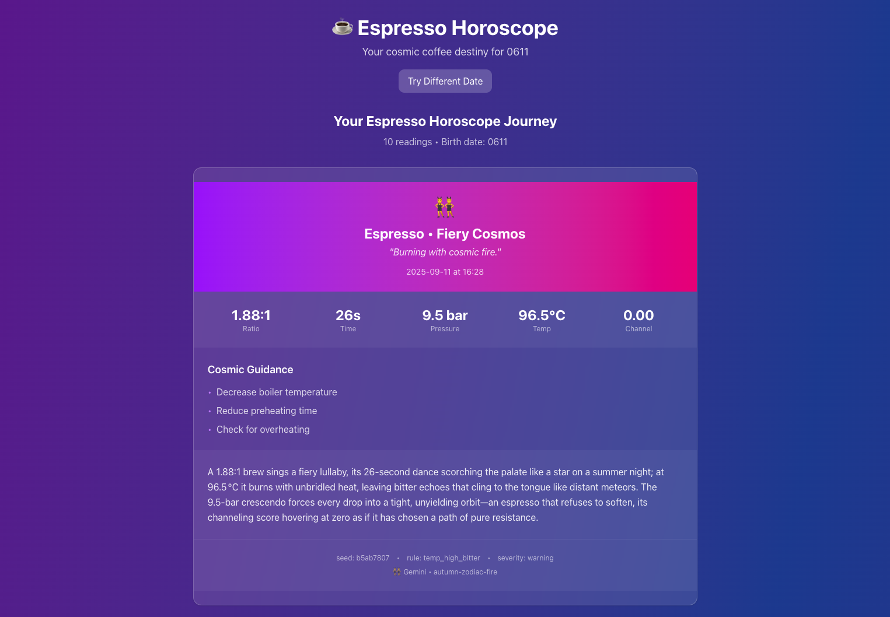
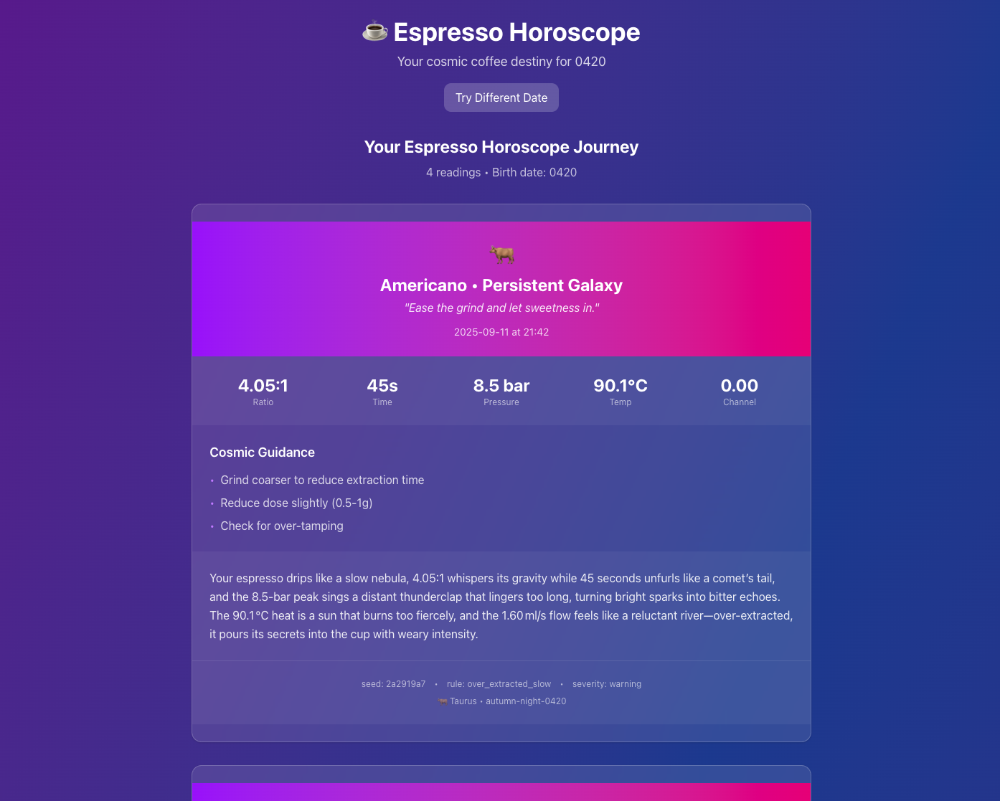

# ☕ Espresso Horoscope MCP

**Transform your espresso shots into personalized cosmic readings!**

A mystical fusion of espresso shot analysis and astrological horoscopes, powered by real Gaggiuino machine data or simulated shot patterns. Generate beautiful, personalized horoscope cards based on your birth date and espresso shot characteristics.

   

## 🏆 OpenAI Open Model Hackathon Entry

**Category**: Best Local Agent + Wildcard
**Repository**: [github.com/vnsavitri/espresso-horoscope-mcp](https://github.com/vnsavitri/espresso-horoscope-mcp)

### 📸 Example Readings

See the [screenshots folder](screenshots/) for more examples of AI-generated cosmic coffee readings:




Each reading combines real espresso metrics with gpt-oss-generated cosmic poetry!

### 🎬 Demo Instructions

1. **Start LM Studio** with `gpt-oss-20b` model loaded
2. **Set environment**: `export OPENAI_BASE_URL="http://localhost:1234/v1"`
3. **Generate demo data**: `MMDD=1007 make demo_user`
4. **Start backend**: `uvicorn web.app:app --reload`
5. **Start frontend**: `cd webui && npm run dev`
6. **Open**: http://localhost:3001
7. **Enter birth date** (MMDD format, e.g., `1007`)
8. **Generate horoscope** and see GPT-OSS in action!

### ✈️ **Airplane Mode Demo** (Proves Offline Capability)

1. **Turn off Wi-Fi** to prove offline inference
2. **Generate a horoscope card** (it will still work!)
3. **Show LM Studio console** streaming tokens
4. **Turn Wi-Fi back on**

### 🎯 **Determinism Demo** (Shows Technical Sophistication)

1. **Same birth date twice** → identical headlines
2. **Change time of day** → style shifts
3. **Change date** → new seed, different card

### 🤖 GPT-OSS Integration

- **Local AI**: Runs completely offline via LM Studio
- **Dynamic Styles**: AI generates unique style names (`dusk-flow`, `stellar-pulse`)
- **Creative Readings**: Poetic descriptions instead of generic templates
- **Fallback System**: Works perfectly even without AI

### ✈️ **Proving Offline Capability**

The system demonstrates true local AI processing:

1. **Turn off Wi-Fi** - Disconnect from internet
2. **Generate horoscope** - System continues working
3. **Show AI console** - LM Studio/Ollama streaming tokens
4. **Reconnect Wi-Fi** - Resume normal operation

This proves the "Best Local Agent" category - no cloud dependencies, no internet required for AI inference.

### ⚡ **One-Minute Validation**

Quick setup for judges to verify the system:

```bash
# 1. Generate demo data
MMDD=1007 make demo_user

# 2. Start services
make web

# 3. Open browser
open http://localhost:3001/?mmdd=1007

# 4. Test determinism
python3 tools/determinism_check.py
```

**Expected results:**

- ✅ Web interface loads with cosmic design
- ✅ Birth date 1007 shows Libra zodiac
- ✅ Determinism test passes (same input = same output)
- ✅ Different birth dates show different zodiac signs

## 🌟 What Makes This Fun in a Weird Way

- **Real Espresso Data**: Uses actual shot metrics from Gaggiuino machines or realistic simulations
- **98 Shot Variants**: Comprehensive coverage including ristretto, lungo, americano, double shots, and more
- **Real Coffee Shot Types**: Titles show actual shot types like "Ristretto • Celestial Perfection" or "Lungo • Burning Galaxy"
- **Dynamic Style Generation**: Each shot gets a unique cosmic personality based on characteristics and timing
- **50+ Curated Styles**: Time-based, cosmic, coffee-inspired, mood-based, and elemental style categories
- **Creative Poetic Readings**: No more boring templates - every reading is a unique cosmic poem
- **Zodiac Integration**: Fun animal emojis and personalized readings based on your birth date
- **Shot-Specific Variety**: Fast shots get "early-pulse" styles, slow shots get "lunar-flow" vibes
- **Time-Based Cosmic Phases**: Morning shots feel different from evening shots
- **Beautiful Visual Design**: Cosmic-themed cards with proper typography and quirky details
- **Real-time Generation**: Dynamic card creation for any birth date with instant variety
- **MCP Integration**: Works as a Model Context Protocol server for AI assistants

## ✨ Cool Features

### 🎭 Dynamic Style Magic

Each horoscope gets a unique cosmic personality from 50+ curated styles:

- **🦢 Libra • ristretto-focus** - Intense, concentrated energy
- **👯‍♂️ Gemini • dawn-pulse** - Quick, energetic morning energy
- **🦁 Leo • cosmic-dream** - Powerful, mystical cosmic flow
- **🏹 Sagittarius • afternoon-flow** - Adventurous, flowing energy

### 📖 Creative Reading System

No more boring "PERFECTION ACHIEVED" - every reading is a unique cosmic poem:

- *"Like a comet streaking across the night sky, your shot blazes through in just 16 seconds"*
- *"Your shot battles against cosmic resistance, like thunder struggling through dense clouds"*
- *"Your shot dances like a synchronized constellation, finding perfect balance"*

### 🕐 Time-Based Cosmic Phases

The same shot feels different depending on when you pull it:

- **Morning**: Dawn-pulse, rising-energy, morning-rhythm
- **Evening**: Dusk-flow, evening-harmony, setting-grace
- **Night**: Stellar-deep, night-rhythm, cosmic-dream

### 🎯 Shot-Specific Personality

Your espresso's characteristics influence its cosmic style:

- **Ristretto shots** → ristretto-focus, espresso-intensity, single-precision
- **Lungo shots** → lungo-patience, americano-gentle, extraction-perfect
- **Double shots** → double-power, brew-mastery, roast-wisdom
- **Fast shots** → early-pulse, stellar-pulse, cosmic-rush
- **Slow shots** → lunar-flow, stellar-drift, cosmic-patience
- **Powerful shots** → stellar-force, cosmic-power, nebula-strength
- **Gentle shots** → lunar-grace, stellar-soft, cosmic-tender

## 🚀 Quick Start

### 🏆 **For Hackathon Judges**

**See [JUDGE_SETUP.md](JUDGE_SETUP.md) for (hopefully) bulletproof setup instructions that work on (almost) any platform!**

### Prerequisites

- **Python 3.8+**
- **Node.js 18+** (for the web interface)
- **Git**

### Installation

1. **Clone the repository**

   ```bash
   git clone https://github.com/vnsavitri/espresso-horoscope-mcp.git
   cd espresso-horoscope-mcp
   ```
2. **Run setup script** (cross-platform)

   ```bash
   # Unix/macOS
   ./setup.sh

   # Windows
   setup.bat

   # Or directly
   python setup.py
   ```
3. **Start the application**

   ```bash
   # Terminal 1: Backend
   python start_backend.py

   # Terminal 2: Frontend
   python start_frontend.py

   # Browser: http://localhost:3001
   ```

## 🎯 Usage Scenarios

### Scenario 1: Demo Mode (No Gaggiuino Machine)

Perfect for judges, users, or anyone who wants to experience the horoscope system without a physical machine.

#### 🌅 Morning Coffee Demo Scenario

*"It's 8 AM and I just brewed my morning espresso with my (imaginary) Gaggia machine. The shot data has been automatically downloaded and processed by the MCP server. Now I just need to input my birth date to get my personalized cosmic reading!"*

#### Setup

```bash
# Start the FastAPI backend
make web

# In a new terminal, start the web interface
cd webui && npm run dev
```

#### Experience the Magic

1. **Open browser**: `http://localhost:3001`
2. **Enter birth date**: Input MMDD format (e.g., `1007` for October 7th)
3. **Click**: "Generate my espresso horoscope"
4. **View your cosmic reading**: See your personalized horoscope card with:
   - Your zodiac sign (e.g., 🦢 Libra)
   - Dynamic style (e.g., `dawn-rhythm`)
   - Creative reading based on your actual shot data
   - Real espresso metrics (ratio, time, pressure, temperature)
5. **Try different dates**: Click "Try Different Date" to explore different zodiac signs

#### The Demo Flow

**"This morning I made coffee..."** → **"The data is already here..."** → **"I input my birth date..."** → **"Voila - my horoscope!"**

This demonstrates the complete vision: real shot data + personalization + instant cosmic guidance, all running locally with AI enhancement.

### Scenario 2: Gaggiuino Machine Integration

For users with a Gaggiuino-equipped espresso machine.

#### 🌅 Real-World Daily Coffee Journey

Imagine you're a Libra (birth date: 1007) with a Gaggiuino machine. Here's how your day would unfold:

**Morning Shot (7 AM):**

- You make your first espresso of the day
- Gaggiuino sensors capture: pressure, temperature, flow rate, shot time
- MCP processes this data in real-time
- System generates: *"Your morning shot flows like a gentle sunrise, achieving cosmic harmony at 1.8:1 in 25 seconds. The universe has chosen this moment to shine."*
- Style: `dawn-rhythm` • 🦢 Libra

**Afternoon Shot (2 PM):**

- You make your second espresso
- **Different shot data** (maybe faster flow, different pressure)
- System generates: *"Your afternoon shot burns with midday intensity, like a star reaching its peak. At 2.1:1 in 18 seconds, the cosmos demands more patience."*
- Style: `stellar-pulse` • 🦢 Libra

**Evening Shot (7 PM):**

- You make your third espresso
- **Another unique shot** with different characteristics
- System generates: *"Your evening shot whispers of cosmic rest, like a star settling into the night. The 1.5:1 ratio in 32 seconds speaks of gentle wisdom."*
- Style: `dusk-flow` • 🦢 Libra

**The Magic:**

- **Same Birth Date = Consistent Zodiac**: All three shots show 🦢 Libra
- **Different Shot Data = Different Readings**: Each shot gets unique cosmic interpretation
- **Time-Based Variation**: Morning vs afternoon vs evening shots get different styles
- **Historical Journey**: You can scroll through your coffee evolution throughout the day
- **No Manual Input**: Everything happens automatically when you brew

#### Supported Gaggiuino Models

- **Gaggia Classic** (all variants)
- **Gaggia Classic Pro**
- **Gaggia Classic Evo**
- **Gaggia New Baby**
- **Gaggia Carezza**

*Note: Requires Gaggiuino firmware with MCP data export capability*

#### Setup

```bash
# Configure your Gaggiuino machine to export shot data
# Place shot data files in the data/ directory

# Start the system
make web
cd webui && npm run dev
```

#### Data Format

The system expects shot data in JSONL format with the following structure:

```json
{
  "timestamp": "2025-01-09T10:30:00Z",
  "brew_ratio": 2.1,
  "shot_time": 28,
  "peak_pressure": 9.0,
  "temp_avg": 92.5,
  "channeling": 0.05,
  "flow_rate": 1.2
}
```

## 🎨 Features

### Dynamic Card Generation

- **Real-time Creation**: Each birth date generates completely new cards
- **Zodiac Integration**: 12 different zodiac signs with unique personalities
- **Deterministic Results**: Same date always produces the same cards
- **Varied Content**: Different dates produce different readings and advice

### Pretty (sorta) Web Interface

- **Cosmic Design**: Purple-blue gradient background with glass morphism
- **Responsive Layout**: Works on desktop and mobile
- **Smooth Animations**: Elegant transitions and loading states
- **Clean Typography**: Professional card design with proper spacing

### Technical Architecture

- **FastAPI Backend**: RESTful API with real-time card generation
- **Next.js Frontend**: Modern React application with TypeScript
- **SVG Card System**: Scalable vector graphics for crisp card rendering
- **MCP Protocol**: Model Context Protocol integration for AI assistants

## 🛠️ Development

### Project Structure

```
espresso-horoscope-mcp/
├── cli/                    # Command-line tools
├── web/                    # FastAPI backend
├── webui/                  # Next.js frontend
├── data_sources/           # Data loading utilities
├── features/               # Feature extraction
├── content/                # Astrological content
├── rules/                  # Diagnostic rules
├── tools/                  # Utility scripts
└── sample/                 # Sample data
```

### Key Commands

```bash
# Generate demo cards for a specific birth date
make demo_user MMDD=1007

# Generate cards with PNG export
make demo_user_png MMDD=1007

# Start backend server
make serve

# Run tests
make test

# Clean generated files
make clean
```

### API Endpoints

- `GET /` - Main web interface
- `GET /cards.json` - Get existing cards
- `GET /generate_cards?mmdd=1007` - Generate new cards for birth date
- `POST /api/card` - Generate PNG card image
- `GET /health` - Health check

## 🎭 Key Technical Details

### Dynamic Style Generation

The system creates unique cosmic personalities by combining:

- **Coffee Profile Analysis**: Extracts personality from shot characteristics
- **Daily Mood Calculation**: Cosmic energy based on birth date and current date
- **Shot-Specific Variation**: Fast/slow/powerful/gentle shots get different styles
- **Time-Based Phases**: Morning/evening/night cosmic influences

### Creative Reading Engine

- **GPT-OSS Integration**: AI-powered unique, poetic descriptions
- **Intelligent Fallbacks**: Beautiful cosmic metaphors when AI unavailable
- **Data-Driven Content**: Every reading references actual shot metrics
- **Variety Engine**: 70+ shot patterns for maximum uniqueness

### GPT-OSS Integration

The system integrates with **GPT-OSS (Open Source GPT)** for enhanced creativity:

- **Local AI Model**: Uses `gpt-oss:20b` via LM Studio or Ollama
- **Dynamic Style Generation**: AI creates unique style names like "cosmic-rhythm", "stellar-harmony"
- **Creative Readings**: AI generates poetic, unique descriptions for each shot
- **Fallback System**: Works perfectly even when AI is unavailable
- **Offline Capable**: All AI processing happens locally

**Setup GPT-OSS:**

1. Install LM Studio or Ollama
2. Download `gpt-oss:20b` model
3. **For LM Studio**: Load the model and start the local server
4. Set `OPENAI_BASE_URL` environment variable:
   ```bash
   export OPENAI_BASE_URL="http://localhost:1234/v1"     # LM Studio (default)
   # or
   export OPENAI_BASE_URL="http://localhost:11434/v1"    # Ollama
   # or
   export OPENAI_BASE_URL="http://YOUR_IP:1234/v1"       # Remote LM Studio
   ```
5. System automatically detects and uses AI when available
6. **Fallback**: Works perfectly without AI using deterministic algorithms

### Deterministic Generation

The system uses a sophisticated seeding mechanism:

```python
seed = hash(shot_id + YYYYMMDD + user_birth_mmdd + style_bank + season + time_of_day)
```

This ensures:

- Same user + same date = same cards
- Different users = different cards
- Different dates = different cards
- Consistent results across sessions

### Zodiac Integration

Each birth date maps to a zodiac sign:

- **Aries** (March 21 - April 19): 🐏
- **Taurus** (April 20 - May 20): 🐂
- **Gemini** (May 21 - June 20): 👯‍♂️
- **Cancer** (June 21 - July 22): 🦀
- **Leo** (July 23 - August 22): 🦁
- **Virgo** (August 23 - September 22): 🦋
- **Libra** (September 23 - October 22): 🦢
- **Scorpio** (October 23 - November 21): 🦂
- **Sagittarius** (November 22 - December 21): 🏹
- **Capricorn** (December 22 - January 19): 🐐
- **Aquarius** (January 20 - February 18): 🐬
- **Pisces** (February 19 - March 20): 🐟

### Card Structure

Each horoscope card includes:

- **Zodiac Sign**: Visual icon and label
- **Title**: Cosmic-themed card name
- **Mantra**: Inspirational quote
- **Espresso Metrics**: Ratio, time, pressure, temperature, channeling
- **Cosmic Guidance**: Personalized advice
- **Narrative**: Flowing description
- **Metadata**: Seed, rule, severity information

## 🤝 Contributing

1. Fork the repository
2. Create a feature branch: `git checkout -b feature/amazing-feature`
3. Commit changes: `git commit -m 'Add amazing feature'`
4. Push to branch: `git push origin feature/amazing-feature`
5. Open a Pull Request

## 📄 License

This project is licensed under the MIT License - see the [LICENSE](LICENSE) file for details.

## 🙏 Acknowledgments

- **[Gaggiuino MCP Server](https://glama.ai/mcp/servers/@AndrewKlement/gaggiuino-mcp)** by Andrew Klement for the MCP protocol integration
- **Astrological Traditions** for the cosmic inspiration

---

**May your shots be perfectly extracted and your cosmic readings be ever enlightening!** ☕✨
