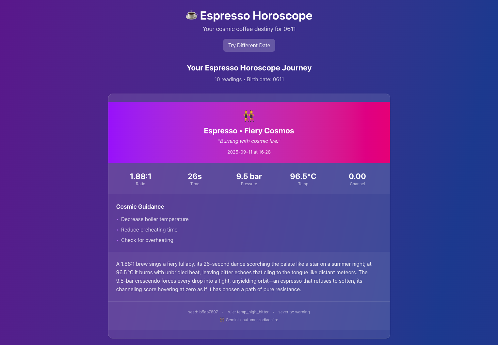
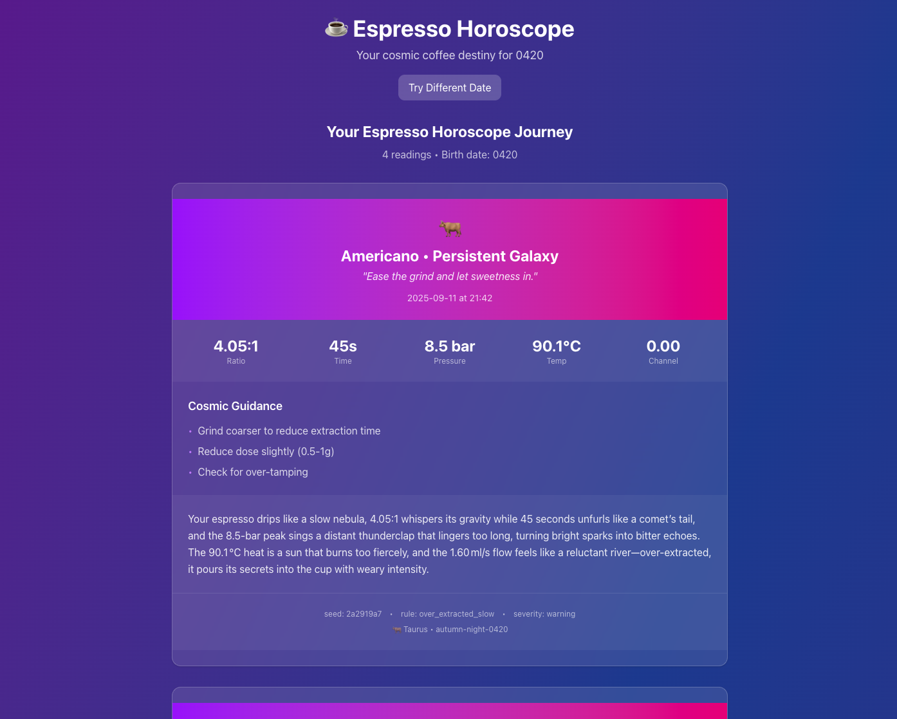
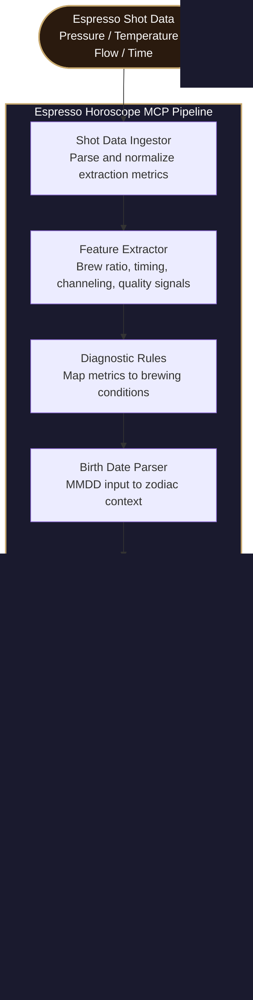

# ☕️ Espresso Horoscope MCP

A local-first MCP project that turns espresso shot metrics (from Gaggiuino espresso machine) and a birth date into a personalised "cosmic" reading, generated offline with a local GPT-OSS model through LM Studio.

Built as a playful hackathon prototype, but structured as a real demonstration of an offline agent pattern: ingest domain data, normalize it, pass it through a strict tool/prompt boundary, and generate a user-facing artifact without cloud inference.

[Watch the 3-minute demo](https://youtu.be/hHNMkw1NXDE)


## Portfolio Snapshot

**What it demonstrates:** local model inference, MCP-style tool boundaries, structured sensor data prompting, deterministic generation, and a lightweight longitudinal memory pattern.

**User experience:** enter a birth date, use simulated or recorded espresso shot data, and receive a tarot-style horoscope card that combines brewing diagnostics with GPT-OSS-generated prose.

**Why it exists:** I wanted to learn how to use local open-weight models under real pressure. The best way for me to do that was to enter a time-boxed hackathon, keep the scope realistic, and build something weird enough to stay interesting.

## Demo

### Video

[](https://youtu.be/hHNMkw1NXDE)

### Screenshots

| Example | What it shows |
|---|---|
|  | High-temperature diagnostic transformed into a horoscope-style warning. |
|  | Over-extraction symptoms mapped to poetic guidance. |
|  | A balanced shot producing a "sweet spot" reading. |

More examples are in [screenshots/](screenshots/).

### Hackathon Slides

<p>
  
  
</p>

## Why This Exists

This was built for the **OpenAI Open Model Hackathon** in the **Best Local Agent** category. The category asked for useful agentic applications of GPT-OSS that could run without internet access.

The honest learning goal was simple: I wanted to get my hands dirty with local model inference. A weekend hackathon with a real submission deadline gave me the right kind of constraint. It forced me to make pragmatic choices, cut scope, and ship a working demo instead of endlessly reading tutorials.

The horoscope framing is deliberately playful. The architecture underneath it is the real point: a reproducible, offline-first local agent workflow that combines structured domain data with local LLM inference through an MCP-shaped interface.

This is not fortune-telling. It is a compact demo of how a local agent can take real-world machine data, preserve deterministic behavior where needed, and still produce an expressive user-facing result.

## What It Does

Espresso Horoscope MCP connects espresso shot data to a local LLM and generates a short personalized reading based on:

- Extraction metrics: brew ratio, pressure, temperature, flow rate, extraction time, and channeling signals
- A birth date input, used for zodiac context and deterministic personalization
- Diagnostic rules that classify the shot as balanced, over-extracted, under-extracted, too hot, too cold, fast, slow, and other brewing patterns
- Reading history, so generated cards can accumulate into a lightweight "coffee journey"

The demo can run with Wi-Fi completely off. No OpenAI API key is required for inference when GPT-OSS is served locally through LM Studio or another OpenAI-compatible local endpoint.

## Architecture


```mermaid
flowchart TD
    A(["Espresso Shot Data\nPressure / Temperature / Flow / Time"])

    A --> B

    subgraph MCP ["Espresso Horoscope MCP Pipeline"]
        direction TB
        B["Shot Data Ingestor\nParse and normalize extraction metrics"]
        B --> C["Feature Extractor\nBrew ratio, timing, channeling, quality signals"]
        C --> D["Diagnostic Rules\nMap metrics to brewing conditions"]
        D --> E["Birth Date Parser\nMMDD input to zodiac context"]
        E --> F["Prompt Builder\nShot metrics + zodiac + style constraints"]
        F --> G["History Tracker\nStore readings per user key"]
    end

    G --> H[("GPT-OSS Local Model\nLM Studio / OpenAI-compatible endpoint")]
    H --> I(["Horoscope Card\nPoetic reading + brew diagnostics + metadata"])

    style MCP fill:#1a1a2e,stroke:#c8a96e,stroke-width:2px,color:#ffffff
    style A fill:#2a1a0e,stroke:#c8a96e,stroke-width:2px,color:#ffffff
    style H fill:#16213e,stroke:#c8a96e,stroke-width:2px,color:#ffffff
    style I fill:#2a1a0e,stroke:#c8a96e,stroke-width:2px,color:#ffffff
```

## Technical Highlights

**Local-first inference via LM Studio**

GPT-OSS runs on-device through an OpenAI-compatible local endpoint. The app can point at LM Studio, Ollama-compatible setups, or a remote LAN machine by changing `OPENAI_BASE_URL`.

**Structured sensor data as LLM context**

The model does not receive vague user text. It receives normalized espresso metrics and diagnostic context. A raw value like `9.1 bar` or `93°C` becomes useful only after the system frames it as pressure stability, temperature risk, extraction quality, or shot style.

**Deterministic generation where it matters**

The system uses seeded generation so the same user/date/shot context can reproduce stable card structure, while still allowing GPT-OSS to add stylistic variation.

```python
seed = hash(shot_id + YYYYMMDD + user_birth_mmdd + style_bank + season + time_of_day)
```

**Fallback behavior**

If a local model is unavailable, the project still produces readings through deterministic templates and curated style banks. That kept the demo resilient during hackathon judging.

**Lightweight longitudinal memory**

Readings are tracked by user key and can accumulate over time. It is intentionally simple: no vector database, no account system, just enough state to show how personal history can shape an agent experience.

## Feature Tour

- **Coffee diagnostics:** rule-based classification for temperature, extraction time, brew ratio, pressure, and channeling patterns.
- **Zodiac personalization:** `MMDD` birth date input maps to a zodiac sign and style context.
- **Dynamic style generation:** shots can become `dawn-pulse`, `stellar-drift`, `ristretto-focus`, `cosmic-rush`, or other horoscope archetypes.
- **Card rendering:** generated readings are shown in a Next.js interface and can be exported as shareable card images.
- **Offline demo path:** local model inference continues to work with Wi-Fi disabled.
- **MCP-oriented data flow:** espresso data ingestion and LLM generation are separated through explicit tool-style boundaries.

## Quick Start

### Prerequisites

- Python 3.8+
- Node.js 18+
- LM Studio with `gpt-oss-20b` loaded, if you want local model generation

### Install

```bash
git clone https://github.com/vnsavitri/espresso-horoscope-mcp.git
cd espresso-horoscope-mcp

# macOS / Linux
./setup.sh

# or direct Python setup
python setup.py
```

### Run With Local GPT-OSS

Start LM Studio, load `gpt-oss-20b`, and enable the local server.

```bash
export OPENAI_BASE_URL="http://localhost:1234/v1"
```

Generate demo cards:

```bash
MMDD=1007 make demo_user
```

Start the backend and frontend:

```bash
# Terminal 1
make web

# Terminal 2
cd webui
npm install
npm run dev
```

Open:

```text
http://localhost:3001/?mmdd=1007
```

## One-Minute Validation

```bash
# Generate demo data for a Libra birth date
MMDD=1007 make demo_user

# Start the FastAPI backend
make web

# In another terminal, start the Next.js frontend
cd webui && npm run dev

# Optional determinism check
python3 tools/determinism_check.py
```

Expected results:

- The web interface loads at `http://localhost:3001`
- Birth date `1007` maps to Libra
- Cards show espresso metrics and a generated reading
- Re-running the same deterministic path keeps stable card identity
- Changing the birth date or shot data changes the reading context

## Airplane Mode Demo

This was the core proof for the hackathon category:

1. Start LM Studio with the local GPT-OSS model loaded.
2. Disconnect Wi-Fi.
3. Generate a horoscope card.
4. Show LM Studio streaming tokens locally.
5. Reconnect Wi-Fi after the card is generated.

The point is not that the app is useful on an airplane. The point is that the model interaction does not depend on a cloud service.

## Project Structure

```text
espresso-horoscope-mcp/
├── cli/                    # Card generation, GPT-OSS helper, seeded history
├── content/                # Astrology and flavor/style source data
├── data_sources/           # Gaggiuino-style shot data loading
├── features/               # Espresso feature extraction
├── rules/                  # Diagnostic brewing rules
├── sample/                 # Sample shot data
├── screenshots/            # Portfolio/demo screenshots
├── slides/                 # Hackathon presentation slides
├── tools/                  # Demo, determinism, export, and utility scripts
├── web/                    # FastAPI backend
└── webui/                  # Next.js card UI
```

## Useful Commands

```bash
# Record sample MCP-style shot JSON into JSONL
make record

# Extract brewing features
make extract

# Generate markdown cards
make cards

# Generate cards for a specific birth date
MMDD=1007 make demo_user

# Generate cards and PNG exports
MMDD=1007 make demo_user_png

# Start the web backend
make web

# Run project checks
make check
```

## API Surface

The FastAPI backend exposes:

- `GET /health` - health check
- `GET /cards.json` - generated cards as JSON
- `GET /generate_cards?mmdd=1007` - generate cards for a birth date
- `GET /` - backend HTML view

The Next.js app runs separately in `webui/` and provides the main portfolio/demo UI, including `POST /api/card` for SVG/PNG card rendering.

## Data Format

Shot data is normalized into JSONL. A representative record looks like:

```json
{
  "timestamp": "2025-01-09T10:30:00Z",
  "brew_ratio": 2.1,
  "shot_time": 28,
  "peak_pressure": 9.0,
  "temp_avg": 92.5,
  "channeling": 0.05,
  "flow_rate": 1.2
}
```

The hackathon demo used simulated and recorded-style Gaggiuino data. The pipeline is designed so real machine exports can be dropped into the same flow once available.

## What I Learned

- **LM Studio is practical for local prototyping.** Its OpenAI-compatible endpoint makes it straightforward to swap between local and cloud-style clients without rewriting the rest of the app.
- **Structured data needs semantic framing.** Espresso numbers are not self-explanatory to a language model. The diagnostic layer turns metrics into meaningful brewing context before prompting.
- **MCP-style boundaries help offline agents stay predictable.** Strict inputs, explicit tool responsibilities, and deterministic fallback behavior made the demo easier to test under time pressure.
- **Scope is an engineering skill.** With a six-week deadline and a full-time job, the project had to stay narrow. The history tracker and dynamic style system were added only after the core offline flow worked.

## Limitations

- The public demo path uses simulated or recorded-style shot data. A production version would need a direct hardware integration with a machine such as a Gaggiuino-enabled Gaggia, Decent DE1, or another espresso system with accessible telemetry.
- Birth date is used as a lightweight user key. A real multi-user version would need proper identity and session management.
- The horoscope style system is prompt- and template-driven. A fine-tuned model or stronger evaluation loop would make tone and style more consistent.
- This is a hackathon MVP, not a production coffee diagnostics platform.

## Tech Stack

| Layer | Tool |
|---|---|
| Agent/data protocol | Model Context Protocol pattern |
| Local inference | GPT-OSS-20B via LM Studio/OpenAI-compatible endpoint |
| Backend | Python, FastAPI |
| Frontend | Next.js 15, React 19, TypeScript |
| Data processing | JSONL, YAML rules, deterministic seeding |
| Card export | SVG/PNG-oriented rendering flow |

## Hackathon Context

**Event:** OpenAI Open Model Hackathon

**Category entered:** Best Local Agent

**Original goal:** learn local GPT-OSS development under a real deadline

**Demo constraint:** show useful model behavior without internet access

I kept the original playful framing because it explains the project honestly: I wanted a small enough scope to finish, a weird enough idea to enjoy building, and a concrete enough data source to make the local-agent pattern real.

## Acknowledgments

- Gaggiuino and the broader espresso modding community for making machine telemetry approachable.
- LM Studio for making local OpenAI-compatible model serving easy to demo.
- The OpenAI Open Model Hackathon for giving this project a real deadline.

## License

MIT. See [LICENSE](LICENSE).

---

Built by [Vivid Savitri-Hampton](https://www.linkedin.com/in/vnsavitri).
